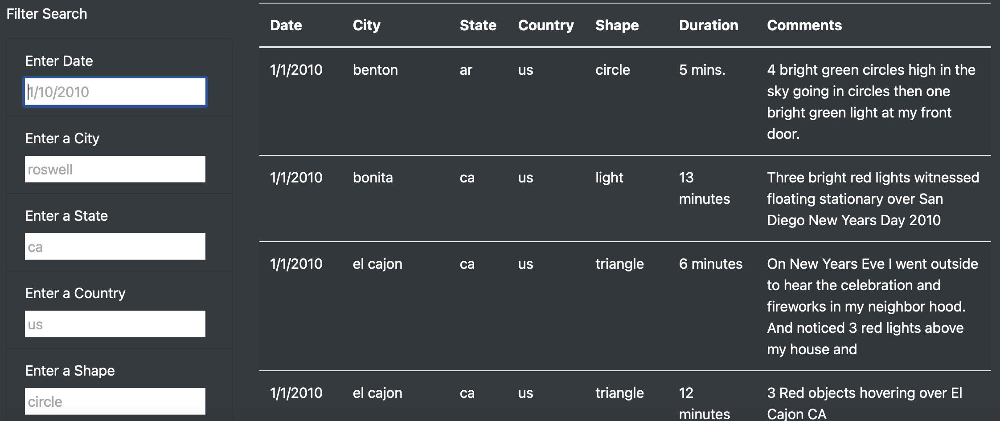
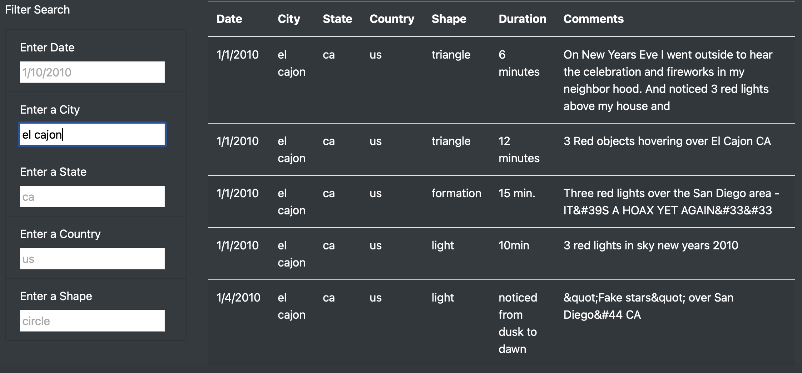
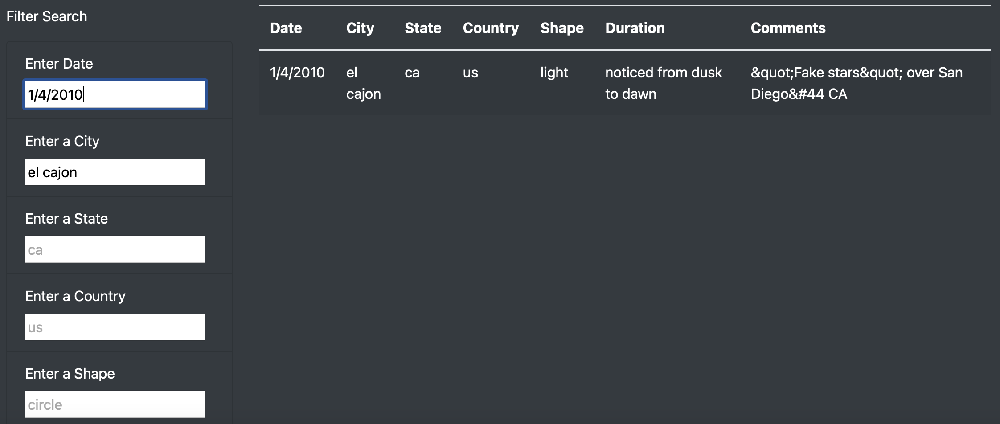

# UFOs
Building webpages with JavaScript
## Overview of the Analysis
- The purpose of this project was to create, for our client Dana, a UFO sighting webpage with a dynamic table that would extract data from a javaScript. Using javaScript and HTML, would allow for the functionality to create, populate, and filter the dynamic table based on what the user sought to search for on the UFO webpage. 

## Results
- Here is what the dynamic table looks without any filters applied.

-  How one might use the search criterias on the UFO sighting webpage, simply requires an individual knowing what they wish to look for. The dynamic table on the UFO sighting webpage comes with five filters that include date, city, state, country, and shape, to tailor to one's desire of knowing if a UFO phenonomenon was recorded.Based from a data javascript file, the filters pull from the data javascript file using javaScript code that brings to life the httml for the webpage. For example, if an individual wished to filter the table to have UFO recorded sightings in the city of el cajon, then the user would simply type it into the "Enter a City" filter "el cajon", and the dynamic table will filter accordingly.

- If we were to go further with the filter, two filters could also be applied to search for UFO sightings in el cajon on that occcured on the date "1/4/2010". 

